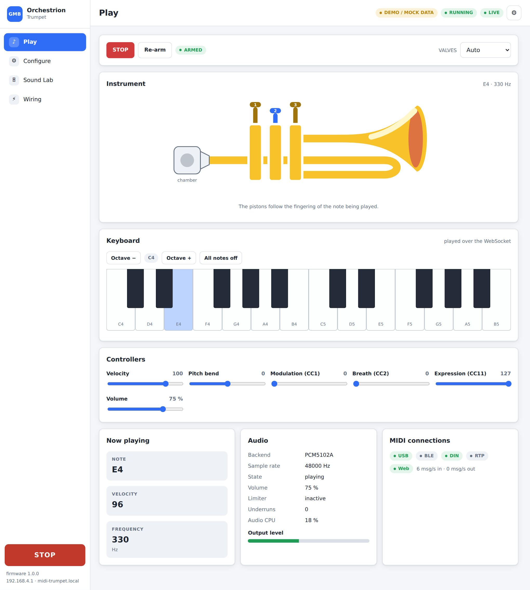
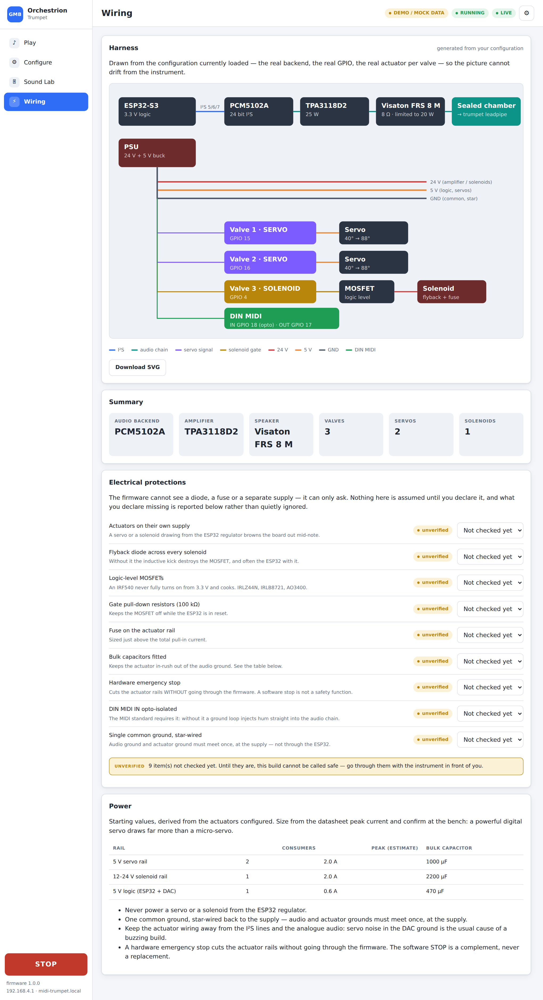
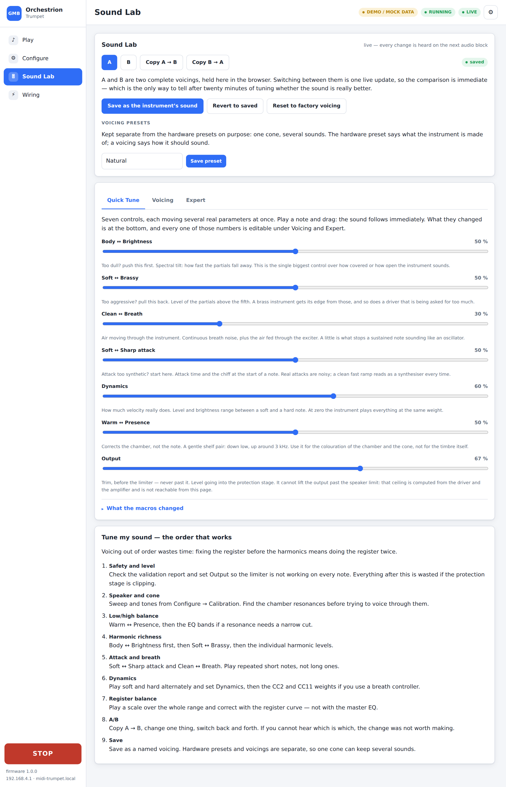

# Orchestrion Trumpet

An open-source **electro-acoustic MIDI trumpet** built around an ESP32.

A loudspeaker in a sealed chamber injects the note directly into the leadpipe,
so the **real trumpet is the resonator**. Three pistons are actuated by servos
or solenoids for the look and the feel of the instrument. Everything is
configured from a **web interface hosted on the board itself** — there is no
line of code to change to swap the DAC, the amplifier, the speaker, the
actuators or the MIDI interface.

```
          USB MIDI
          BLE MIDI
          RTP MIDI
          DIN MIDI
          Web UI
             │
             ▼
          ESP32-S3
             │
        MIDI ROUTER
        ┌────┴─────┐
        ▼          ▼
      SYNTH      VALVES
        │       ┌──┴──┐
        ▼       ▼     ▼
      I2S     SERVO SOLENOID
        │
        ▼
       DAC
        │
        ▼
      AMPLIFIER
        │
        ▼
      SPEAKER
        │
        ▼
    AIR CHAMBER
        │
        ▼
      TRUMPET
```

---

## What it is

One firmware image, many instruments. The board is detected at boot and the
web UI only ever offers what the silicon in front of you can actually do: a
plain ESP32-WROOM never shows USB-MIDI, an ESP32-S3 never shows the internal
DAC. Everything else — audio chain, valves, MIDI routing — is a runtime
choice stored in a versioned JSON file on the board's own filesystem.

## How it works

Six layers, each one talking only to the next through an interface:

```
             MIDI INPUTS
                  │
                  ▼
            MIDI ROUTER
                  │
        ┌─────────┴─────────┐
        ▼                   ▼
 SOUND ENGINE         VALVE ENGINE
        │                   │
        ▼                   ▼
 AUDIO ENGINE        ACTUATOR HAL
        │                   │
        ▼                   ▼
 AUDIO BACKEND        SERVO / SOLENOID
        │
        ▼
 AMPLIFIER PROFILE
        │
        ▼
 SPEAKER PROFILE
        │
        ▼
ACOUSTIC COUPLING
        │
        ▼
     TRUMPET
```

The sound engine has never heard of I²S. The MIDI router has never heard of a
piston. That independence is the whole point of the project, and
[docs/ARCHITECTURE.md](docs/ARCHITECTURE.md) explains how it is enforced.

## Supported hardware

| Target | Wi-Fi | BLE MIDI | DIN MIDI | I²S | Web UI | USB-MIDI | Internal DAC | OTA |
|---|---|---|---|---|---|---|---|---|
| **ESP32-S3** (`esp32-s3-devkitc`) | yes | yes | yes | yes | yes | **yes**, class compliant | no (chip has none) | yes |
| **ESP32-WROOM-32** (`esp32dev`, 4 MB) | yes | yes | yes | yes | yes | no (no native USB) | yes (8 bit) | no — see below |
| **ESP32-WROOM-32** (`esp32dev_8mb`) | yes | yes | yes | yes | yes | no | yes (8 bit) | yes |

> **OTA on a 4 MB ESP32.** With BLE, Wi-Fi and the web server the firmware is
> about 2.0 MB, which does not leave room for two OTA slots inside 4 MB. That
> environment therefore uses a single application partition, the firmware
> detects the missing slot at runtime, and the Firmware page says so instead of
> offering a button that could not work. Use an 8 MB module (`esp32dev_8mb`)
> or flash over USB.

## MIDI connectivity

| Interface | In | Out | Notes |
|---|---|---|---|
| **USB-MIDI** | ✔ | ✔ | ESP32-S3 only. Class compliant: no driver on Windows, macOS, Linux, a Raspberry Pi or a DAW. |
| **BLE MIDI** | ✔ | ✔ | Standard MMA/Apple profile. Bluetooth name configurable, default `GMB MIDI Trumpet`. |
| **RTP-MIDI / AppleMIDI** | ✔ | ✔ | Over Wi-Fi, ports 5004/5005, advertised over mDNS as `_apple-midi._udp`. |
| **DIN MIDI** | ✔ | ✔ | 31250 baud 8N1, plus a byte-level THRU. The input needs an optocoupler — see [docs/HARDWARE.md](docs/HARDWARE.md). |
| **Web UI** | ✔ | ✔ | The on-screen keyboard, over the WebSocket. |

All five are sources of the same router, and every route carries its own
channel filter, transpose, velocity curve and note range.
See [docs/MIDI.md](docs/MIDI.md).

## Audio configurations

| Backend | Role | Maturity |
|---|---|---|
| `PCM5102A` | I²S DAC → external amplifier. **Reference chain.** | stable |
| `MAX98357A` | I²S class-D amplifier, speaker attached directly. 16 bit. | stable |
| `ESP32_INTERNAL_DAC` | 8 bit, ESP32 classic only. Bring-up only. | prototype |
| `ES8388` | Codec, DAC + ADC. Microphone input reserved for acoustic calibration. | experimental |
| `WM8960` | Codec, DAC + ADC. | experimental |
| `TAS5760M` | I²S class-D amplifier, target of the integrated PCB. | experimental |

"Experimental" means the driver is written from the datasheet and compiles for
both targets, but the project has not validated it on silicon. That badge is
shown in the web UI too — nothing is presented as more finished than it is.

Documented bundles, selectable in one click:

| Preset | Chain | Relative quality |
|---|---|---|
| `LOW_COST` | ESP32 → MAX98357A → Dayton CE70PR-4 | ★★★ |
| `COMPACT` | ESP32 → MAX98357A → Visaton FRS 5 XTS | ★★★ |
| **`STANDARD`** | ESP32 → PCM5102A → TPA3118D2 → Visaton FRS 8 M → sealed chamber → trumpet | ★★★★½ |
| `QUALITY` | ESP32 → PCM5102A → TPA3118D2 → Monacor SPX-30M | ★★★★★ |
| `FEEDBACK` | ESP32 → ES8388 → TPA3118D2 → FRS 8 M + measurement microphone | ★★★★½ |
| `INTEGRATED` | ESP32 → TAS5760M → speaker (dedicated PCB) | ★★★★½ |

`STANDARD` is the reference used for audio development.
See [docs/AUDIO.md](docs/AUDIO.md) and [docs/BOM.md](docs/BOM.md).

## Valve configurations

One to four valves, **each independently** a servo or a solenoid — a mixed
instrument is an ordinary configuration, not a special case.

* **Servo** — ESP32 LEDC PWM or a PCA9685 expander, with a speed and
  acceleration limited motion planner, and the PWM detached once the movement
  is over so the servo stops buzzing, drawing current and heating.
* **Solenoid** — logic-level MOSFET, pull-in burst then a lower hold level,
  with a **mandatory** maximum continuous ON time, a duty-cycle ceiling and a
  cooldown. The guard fires even if a MIDI note never ends.

Modes: `AUTO` (note → fingering), `MANUAL` (from the web UI), `MIDI_CC` (one
controller per valve), `DISABLED`.
See [docs/VALVES.md](docs/VALVES.md).

---

## Quick start

```bash
git clone https://github.com/glloq/orchestrion_trumpet
cd orchestrion_trumpet

# ESP32-S3 (default target)
pio run -e esp32-s3-devkitc -t upload      # firmware
pio run -e esp32-s3-devkitc -t uploadfs    # web interface into LittleFS

# ESP32-WROOM-32
pio run -e esp32dev -t upload
pio run -e esp32dev -t uploadfs
```

Then:

1. Power the board. It creates a hotspot named **`MIDI-Trumpet-XXXX`**
   (`XXXX` comes from the MAC address), open by default.
2. Connect to it and open **<http://192.168.4.1>**. A captive portal usually
   opens the page by itself.
3. The setup wizard walks you through board → audio backend → amplifier →
   speaker → valves → MIDI → GPIO validation → audio test → valve calibration
   → save.
4. Save and let it reboot. The instrument is ready.

Once it has joined your own Wi-Fi it is also reachable as
**<http://midi-trumpet.local>**.

## Web configuration

`Play · Configure · Sound Lab · Wiring`, plus one settings modal
(`Device · MIDI · Audio · Pistons · Diagnostics · Firmware`).



The everyday views never mention a GPIO or an I²S clock. Everything rare or
dangerous — pin assignments, DMA, bit depth, limiter internals, servo timing,
solenoid PWM — is folded away behind a disclosure in Settings. Before any save
the configuration is checked for duplicated pins, flash and strapping pins,
board capabilities and speaker/amplifier compatibility, and the result is shown
as `ERROR`, `WARNING` or `INFO`.

The **Wiring** view draws the harness from the configuration that is actually
loaded — the real backend, the real GPIO, one row per valve — and offers it as
a downloadable SVG to take to the bench. Underneath it, the electrical dossier
asks you to declare the protections the firmware cannot see (flyback diodes,
logic-level MOSFETs, fuse, separate actuator supply, hardware emergency stop).
Nothing is assumed: what you have not declared stays `unverified`.



### Sound Lab

Voicing an instrument is a session, not a settings page, so it gets its own
view and everything on it is **live**: a slider posts to `/api/audio/preview`,
the firmware drops the voicing into a lock-free mailbox and the audio task
picks it up at the start of the next block — about 2.7 ms. Nothing is saved and
nothing reboots until you say so.



Quick Tune gives seven musical macros; Voicing exposes the 16 harmonic levels,
the spectral tilts, the dynamics weights, six EQ bands and the register
compensation curves; Expert has the experimental brass exciter and the whole
voicing as JSON. **A** and **B** are two complete voicings you can switch
between instantly — the only reliable way to tell, after twenty minutes of
tuning, whether the sound is actually better.

The split between *sound* and *safety* is enforced by construction: the live
path deserialises into a `VoicingConfig`, and speaker impedance, power ratings,
the protection limit, the hard ceiling and the pins are simply not members of
it. They still go through validation and a reboot.

Locked out of the network? Hold the board's **BOOT button for two seconds** and
the hotspot comes back up. Wi-Fi passwords live on the device and are never
written into an exported configuration.

More screenshots, the REST API and the WebSocket protocol:
[docs/WEB_UI.md](docs/WEB_UI.md).

## Wiring

Full schematics, pin maps, power architecture and the DIN MIDI optocoupler
circuit are in [docs/HARDWARE.md](docs/HARDWARE.md); the shopping list per
preset is in [docs/BOM.md](docs/BOM.md).

## Build

Requirements: [PlatformIO](https://platformio.org/) 6.1 or newer.

```bash
pio run                 # default environment (ESP32-S3)
pio run -e esp32dev     # ESP32-WROOM-32
pio test -e native      # 102 host unit tests, no board required
```

The project uses the [pioarduino](https://github.com/pioarduino/platform-espressif32)
platform because the upstream `espressif32` platform is frozen on
Arduino-ESP32 2.0.17 and this firmware needs 3.x (ESP-IDF 5.4) for the I²S
standard driver and the TinyUSB MIDI class.

Only two third-party libraries are used, both explicitly versioned:
`bblanchon/ArduinoJson` and `links2004/WebSockets`. BLE MIDI, RTP-MIDI, the
PCA9685 driver, the servo PWM generator and the audio codec drivers are
implemented in-tree so a third-party breakage cannot take the project down.

## Flash

```bash
pio run -e esp32-s3-devkitc -t upload      # over USB
pio run -e esp32-s3-devkitc -t uploadfs    # web UI
```

Or, on a board with two OTA slots, drag the `.bin` onto the **Firmware** page.
The instrument mutes the audio, releases every valve and de-energises the
solenoids before the first byte is written.

## Safety

Read this before wiring anything that moves.

* **Never power a solenoid or a servo from the ESP32 regulator.** Use a
  separate supply with a common ground.
* Every solenoid needs a **flyback diode**, a **fuse** and **bulk decoupling**.
  The MOSFET must be logic level.
* Fit a **physical emergency stop** that cuts the servo/solenoid supply
  *without* going through the firmware. The ESP32 may stay powered to display
  the fault.
* The solenoid thermal guard is not optional and cannot be switched off from
  the web UI: a configuration with no maximum ON time is refused.
* The speaker limiter derives its ceiling from the speaker power, its
  impedance and the amplifier rating. The soft limiter can be disabled; the
  hard ceiling cannot.
* At boot, and after any watchdog reset, the valves are released and the audio
  stays muted until every peripheral has been initialised. An invalid
  configuration brings the instrument up in **SAFE MODE**: Wi-Fi and the web
  configuration only, no actuator ever energised.

## Documentation

| File | Contents |
|---|---|
| [docs/ARCHITECTURE.md](docs/ARCHITECTURE.md) | Layers, tasks, priorities, boot sequence, real-time rules |
| [docs/HARDWARE.md](docs/HARDWARE.md) | Wiring, pin maps, power, DIN MIDI circuits, emergency stop |
| [docs/MIDI.md](docs/MIDI.md) | Transports, router, supported messages, monophonic behaviour |
| [docs/AUDIO.md](docs/AUDIO.md) | Synthesis, backends, speaker protection, acoustic coupling |
| [docs/VALVES.md](docs/VALVES.md) | Fingering, servos, solenoids, safety, calibration |
| [docs/WEB_UI.md](docs/WEB_UI.md) | Views, screenshots, REST API, WebSocket protocol |
| [docs/BOM.md](docs/BOM.md) | Bill of materials per configuration |

## Status

The V1 acceptance criteria and what is genuinely implemented versus prepared
are tracked in [docs/ARCHITECTURE.md § Status](docs/ARCHITECTURE.md#status).
In short: everything in this README is implemented and compiles for both
targets; the parts that are *prepared but not finished* — sample playback,
microphone-based acoustic calibration, MPE — are named as such here, in the
documentation and in the web UI, and are never presented as working.

**The software is well ahead of the hardware.** The host suite covers the
configuration, the router, the DSP, the fingering chart, the solenoid guard,
the acoustic model and the attack timing; compiling for the ESP32 proves the
code builds, not that a DAW enumerates the USB device or that the FRS 8 M
survives an hour of sustained tone. The remaining work is not more
architecture, it is the bench:

```
1  ESP32-S3 + PCM5102A + TPA3118 + FRS 8 M, and measure:
   frequency response, SPL, distortion, current, voice-coil
   temperature, underruns, MIDI -> audio latency
2  the three actuation paths: servo on ESP32 PWM, servo on PCA9685, solenoid
3  every MIDI transport, on Windows / macOS / Linux / Raspberry Pi
4  only then: ES8388, WM8960 and TAS5760M from EXPERIMENTAL to STABLE
```

Nothing in the acoustic model is a measurement, and the UI says so next to
every number it derives.

## License

MIT — see [LICENSE](LICENSE).
