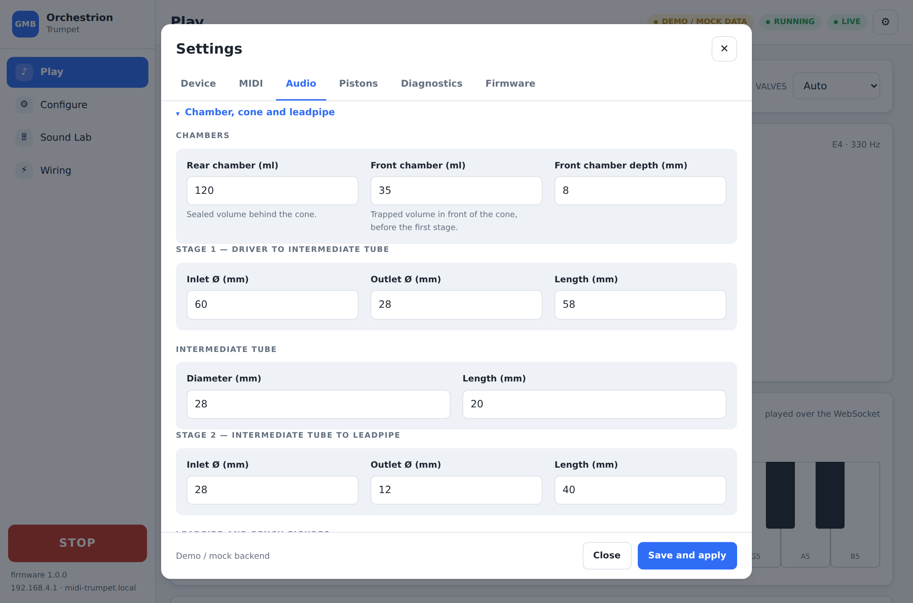
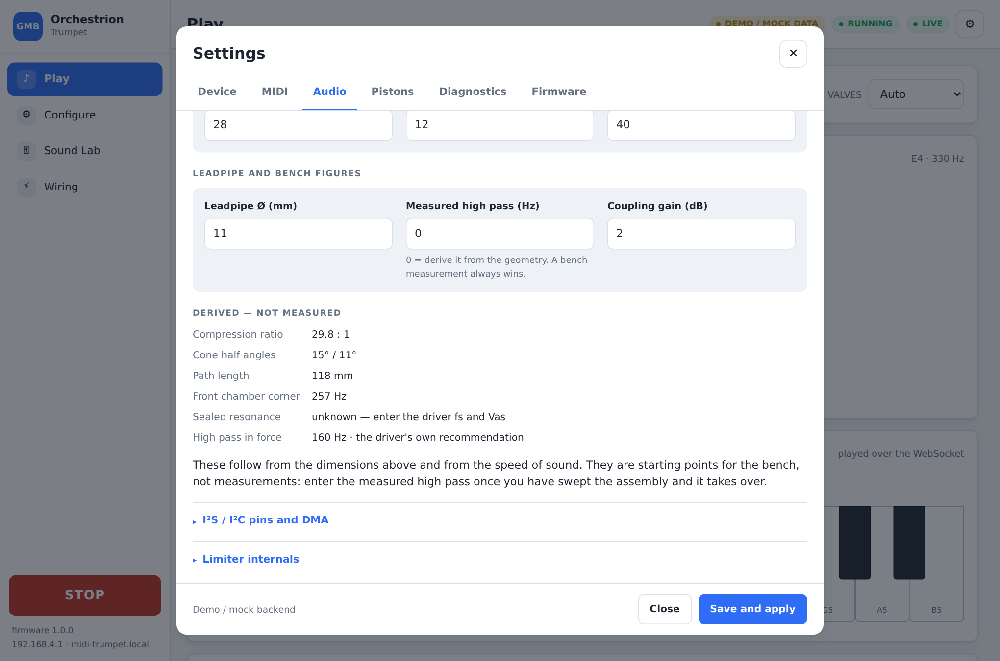

# Audio

## Signal chain

```
MIDI note
   ↓
pitch generator      note + bend + vibrato + portamento -> Hz
   ↓
harmonic generator   additive / wavetable / hybrid / sine
   ↓
envelope             ADSR
   ↓
attack noise         chiff at the start of the note + breath floor
   ↓
vibrato              applied in the pitch domain, at control rate
   ↓
EQ                   three user bands
   ↓
speaker compensation the driver's own voicing curve
   ↓
limiter              soft limiter + hard ceiling
   ↓
audio backend        I²S DMA
```

The engine produces a mono float stream in [−1, 1]. It has never heard of
I²S: the backend deals with the wire format, the bit depth and the DMA.

## Default format

| Parameter | Default | Notes |
|---|---|---|
| Sample rate | 48 000 Hz | 22.05 / 32 / 44.1 / 48 kHz available |
| Bit depth | 24 bit | reduced automatically when the backend cannot do it |
| Channels | mono | the instrument is one voice; only the left slot is fed |
| Block size | 128 frames | ≈2.7 ms at 48 kHz |
| DMA buffers | 6 | ≈16 ms of ring |
| Internal DSP | `float` | 32 bit, with a Q31 conversion at the very end |

A 24 bit request is carried in 32 bit I²S slots with the sample left-aligned.
Every DAC in the catalogue accepts that framing, and it avoids the 3-byte
alignment rules of native 24 bit slot mode.

## Generators

| Engine | Cost | Character |
|---|---|---|
| `ADDITIVE` | ~10 interpolated table lookups per sample | The reference. Harmonic content follows the playing dynamics. |
| `WAVETABLE` | one interpolated lookup | Cheaper. Band-limited mip-map, two voicings cross-faded. |
| `HYBRID` | both | 60 % additive, 40 % wavetable. |
| `SINE` | one lookup | The additive engine with a single harmonic. A test tone, not an instrument. |

`SAMPLE` is deliberately **absent** from the enumeration and from the UI: the
storage backend (Flash / LittleFS / SD / PSRAM) is not written, and the
project rule is never to expose an option that is not wired to a real
function. The generator interface is ready for it.

### Additive synthesis

A brass instrument is essentially a harmonic series whose upper partials grow
with the blowing pressure:

```
f, 2f, 3f, 4f, 5f, … Nf        up to 16 partials, each with its own amplitude
```

The "blow" parameter is a weighted mix of:

| Source | Default weight |
|---|---|
| Velocity | 0.85 |
| CC 2 (breath) | 0.70 |
| CC 11 (expression) | 0.35 |
| Channel pressure | 0.25 |
| Note pitch | 0.30 |

It drives a roll-off exponent between 2.6 (soft, dark) and 0.6 (loud,
brilliant):

```
low velocity   →  softer sound, fewer upper harmonics
high velocity  →  brighter sound, more harmonics
```

Partials above Nyquist are simply not summed, and the last audible ones fade
rather than stopping abruptly, so the engine never aliases when a note glides
through the top of the range.

Recomputing the gains costs a `pow()` per partial, so it happens only when the
brightness moved by more than 0.4 % or the frequency changed — at control
rate, never per sample.

### Wavetable

Eight mip levels, one per octave, 512 points each, stored as `int16_t` — 16 kB
for the whole set. Each level is built with only the partials that still fit
under Nyquist at the top of its octave. Two voicings (dark and bright) are
cross-faded by the same "blow" parameter as the additive engine, so both
generators react identically to the controllers.

## Envelope

ADSR, plus the two noise components that make a synthetic trumpet sound blown
rather than generated:

| Parameter | Default | Role |
|---|---|---|
| Attack | 12 ms | short, to keep the punch of the initial note |
| Decay | 90 ms | natural transition into the sustain |
| Sustain | 0.82 | level held while the note lasts |
| Release | 70 ms | quick but not instant |
| Attack noise | 12 % | the "chiff" of the first air burst, decaying over the attack |
| Breath noise | 3 % | continuous air floor under the note |

## Vibrato

| Setting | Default | Range |
|---|---|---|
| Source | CC 1 | CC 1, channel pressure, always on, off |
| Rate | 5.5 Hz | 1–12 Hz |
| Depth | 22 cents | 0–100 cents |
| Delay | 250 ms | before it starts |
| Fade-in | 350 ms | how long it takes to reach full depth |

Applied in the pitch domain at control rate. 5–7 Hz with a small depth is what
a player's breath actually does.

## Pitch bend

±1, ±2, ±3 or ±12 semitones, default **±2**.

## Speaker protection

The maximum safe level is **computed**, never guessed:

```
V_amp  = √(P_amp_max × Z)          full scale digital -> amplifier peak voltage
V_safe = √(P_speaker_limit × Z)    voltage that dissipates the allowed power
scale  = min(1, V_safe / V_amp) × volumeLimit
```

Worked example, the `LOW_COST`-style mismatch of a small driver behind a big
amplifier:

```
speaker  Visaton FRS 5 XTS, 8 Ω, 4 W allowed
amp      TPA3118D2, 25 W

V_amp  = √(25 × 8) = 14.1 V
V_safe = √(5  × 8) =  6.3 V
scale  = 6.3 / 14.1 = 0.45      the DSP may use 45 % of full scale
```

And the matched case:

```
speaker  Visaton FRS 8 M, 8 Ω, 20 W allowed
amp      MAX98357A, 3.2 W        the amplifier cannot overdrive the driver
scale    = 1.0                   nothing is taken away
```

The scale is clamped to a minimum of 2 %: silence is not a safe state either,
and a user staring at a dead instrument will disable the protection.

### Protection stages

| Stage | Can it be disabled? |
|---|---|
| Peak scale from the speaker and amplifier profiles | **no** |
| Soft limiter (threshold, attack, release) | yes, from the Audio page |
| Hard ceiling, clamping every sample | **no** |
| High pass | the value is configurable, the strictest of the three sources wins |
| DC blocker | **no** — DC into a class-D stage is a direct route to a burnt coil |
| Startup mute | yes, but it defaults to on |
| Shutdown / OTA mute | **no** |

The effective high pass is the strictest of:

* the value on the Calibration page,
* the speaker profile's recommendation,
* the acoustic coupling's corner.

## Backends

| Backend | Bit depth | Control | Capture | Maturity |
|---|---|---|---|---|
| `NONE` | — | — | no | stable |
| `ESP32_INTERNAL_DAC` | 8 | — | no | **prototype** |
| `MAX98357A` | 16 | SD_MODE pin | no | stable |
| `PCM5102A` | up to 32 | optional XSMT pin | no | stable |
| `ES8388` | up to 32 | I²C | **yes** | experimental |
| `WM8960` | up to 32 | I²C | **yes** | experimental |
| `TAS5760M` | up to 32 | I²C (optional) + SPK_SD | no | experimental |

*Experimental* means: written from the datasheet, compiled for both targets,
not validated on silicon by the project. The badge is shown in the web UI and
in the diagnostics — a backend is never labelled stable until it has been
heard.

Every backend comes up **muted**. Unmuting is the very last step of the boot
sequence, once every peripheral has been validated.

`NONE` is a real backend, not a stub: the audio task keeps running at the
right pace by pacing itself on the FreeRTOS clock, so the rest of the firmware
behaves identically — it just makes no sound. It is what SAFE MODE uses, and
what a valve-only instrument uses.

## The voicing, and what may change live

The sound and the safety are two different things and are now two different
structures.

```
VoicingConfig                      AudioConfig / SpeakerConfig / AmplifierConfig
────────────                       ─────────────────────────────────────────────
generator                          backend, sample rate, bit depth, block, DMA
16 harmonic levels                 I²S / I²C pins, codec address
spectral tilts                     speaker impedance, RMS and maximum power
hybrid mix                         protection limit, hard ceiling, DC blocker
envelope, noises                   amplifier type, gain, volume limit
vibrato                            master volume
dynamics weights                   startup mute
6 EQ bands
register compensation
exciter
output trim
      ↓                                          ↓
CHANGES LIVE, no reboot            validation + save + reboot
POST /api/audio/preview            PUT /api/config
```

A voicing is the **only** thing the live path can touch. That is enforced by
construction rather than by a check: `/api/audio/preview` deserialises into a
`VoicingConfig`, and impedance, power ratings, the protection limit and the
pins are simply not members of it. A laboratory slider that can switch off the
thing protecting the coil is not a laboratory slider.

### How live it actually is

```
slider  ->  POST /api/audio/preview  ->  ConfigValidator::sanitiseVoicing
        ->  single-slot mailbox in AudioEngine
        ->  picked up at the start of the next audio block   (2.7 ms @ 48 kHz)
        ->  sound
```

The network task never touches a DSP object. It writes one `VoicingConfig`
into a mailbox and sets a flag; the audio task drains it before the MIDI queue,
so a preview and the notes that follow it in the same block agree about the
sound. A ring buffer would be pointless here — a slider produces far more
updates than there are blocks and only the newest one matters.

Changing a voicing deliberately does **not** retrigger the note being
auditioned. Restarting the envelope on every slider movement makes a live
preview useless.

`sanitiseVoicing()` is the guard on that path and is host-tested. It replaces
NaN rather than clamping it (a NaN poisons every filter it touches and the only
symptom is silence), clamps every range, and sorts the register curve — which
is walked in order, so an unsorted one would silently skip breakpoints.

Three actions, and only the third writes to flash:

| Action | Endpoint | Effect |
|---|---|---|
| Preview | `POST /api/audio/preview` | changes the sound now, saves nothing |
| Revert | `POST /api/audio/revert` | back to the stored voicing |
| Commit | `POST /api/audio/commit` | the live sound becomes the stored one |

### Named voicings

Up to four, stored beside the configuration and deliberately separate from the
hardware presets: the hardware preset says what the instrument is made of, a
voicing says how it should sound. One cone, several sounds.

`Program Change` can select one, but only if the user turns it on: a sequencer
sending bank changes should not silently change the sound of the instrument.

### What used to be hard-coded

Five numbers that had to move to match an exciter to a cone were literals in
the DSP. They are configuration now, and a migrated instrument gets exactly the
values that used to be compiled in, so it sounds identical:

| Parameter | Was | Now |
|---|---|---|
| Dark spectral tilt | `2.6f` in AdditiveSynth | `voicing.darkTilt` |
| Bright spectral tilt | `0.6f` | `voicing.brightTilt` |
| Hybrid mix | `a * 0.6f + w * 0.4f` | `voicing.hybridMix` |
| Velocity → amplitude | `0.25f + 0.75f * v` | `voicing.velocityFloor` |
| Aftertouch → brightness | `0.25f` | `voicing.aftertouchToBrightness` |

## Register compensation

`pitchBrightness` alone is a single global slope and cannot fix a system whose
bottom is weak, whose middle is right and whose top is harsh. Two interpolated
curves do:

```
MIDI note  ->  output gain (dB)
MIDI note  ->  brightness offset
```

Five breakpoints, linearly interpolated, with the end values held outside the
range — extrapolating a correction curve is how a register fix turns into a
broken top octave. Correcting this with the master EQ instead would wreck the
timbre everywhere.

## Brass exciter — EXPERIMENTAL

A second generator, offered to be characterised against `ADDITIVE`, which stays
the reference. It is **not** a physical model and deliberately is not one: the
real trumpet is the resonator, so there is nothing downstream of the cone left
to simulate.

```
oscillator ──┐
             ├──> x drive(pressure) ──> asymmetric shaper ──> out
air noise  ──┘
```

* the noise goes in **before** the shaper, so it is shaped: shaped noise reads
  as breath moving through the instrument, noise added afterwards reads as hiss
  on top of a synthesiser;
* the **asymmetry** is what produces even harmonics — a symmetric transfer
  function only ever gives odd ones, which is a clarinet;
* `tanh(x)/tanh(drive)` keeps the output near unity whatever the drive, so
  turning the drive up changes the timbre and not the level. The limiter should
  never be the thing that decides how brassy the instrument is;
* pressure rises over `transientMs` at the start of a note, which is what gives
  the attack its character rather than an amplitude envelope alone.

It has never been heard through a real cone. The UI says so, in those words.

## Acoustic coupling

| Profile | Behaviour | Use |
|---|---|---|
| `OPEN` | nothing is modelled, the driver's own corner applies | driver in free air, bench testing |
| `SEALED_CHAMBER` | the geometry below | **the reference build** |
| `CUSTOM_CHAMBER` | the same geometry, your dimensions | your own assembly |

The speaker is a **pressure generator feeding the instrument**, not a
loudspeaker in a box:

```
sealed rear chamber        120 ml
      |
   [driver]
      |
front chamber              35 ml, 8 mm deep
      |
stage 1 cone               Ø60 -> Ø28 over 58 mm
      |
intermediate tube          Ø28, 20 mm
      |
stage 2 cone               Ø28 -> Ø12 over 40 mm
      |
trumpet leadpipe           Ø11
```

### What the firmware derives from it, and what it does not

`src/audio/AcousticModel.cpp` computes, from that geometry and from the speed
of sound alone:

| Figure | How |
|---|---|
| Compression ratio | cone area / leadpipe area |
| Cone half angles | `atan((r_in − r_out) / L)` per stage |
| Front chamber corner | Helmholtz, first order: `(c/2π)·√(A/(V·L_eff))` |
| Sealed resonance | `fs·√(1 + Vas/Vb)` — **only when fs and Vas are entered** |

Everything is labelled with where it came from — `MEASURED`, `DERIVED` or
`SPEAKER_PROFILE` — and the UI prints that label next to the number. **These
are starting points for the bench, not measurements.** Entering a measured
high pass makes it take over immediately; the model never overrides a
measurement.

What the firmware deliberately does **not** do is invent Thiele-Small
parameters. `fs` and `Vas` are properties of the specific driver; they are
transcribed only where they were actually read off a datasheet (Visaton
FRS 8 M fs = 125 Hz, Monacor SPX-30M fs = 100 Hz) and are otherwise zero. With
`Vas` unknown the sealed resonance is reported as *unknown* rather than as a
plausible-looking guess, and the high pass falls back to the driver's own
recommendation.





The validator warns when the geometry is outside what a cone can do: a
compression ratio below 2:1 or above 12:1, a cone half angle past 30° (it
reflects instead of transforming), or a front-chamber corner below 4 kHz (a
trumpet needs its harmonics well past that).

> The reference dimensions above trip two of those warnings — 29.8:1
> compression and a 257 Hz front-chamber corner — which is the model doing its
> job: a 35 ml volume in front of the cone, feeding a 118 mm path down to
> 11 mm, behaves as a resonator rather than as a wideband transformer. The
> numbers are kept as specified rather than quietly adjusted; the bench decides
> whether to shrink the front chamber, shorten the path, or measure something
> that disagrees with the model.

### Speaker catalogue

Two distinct manufacturer figures are recorded, because conflating them is how
a driver gets cooked:

| Driver | Ω | Rated (RMS) | Maximum | Firmware limit |
|---|---|---|---|---|
| Visaton FRS 5 XTS | 8 | 5 W | 8 W | 4 W |
| Dayton Audio CE70PR-4 | 4 | 20 W | 30 W | 8 W |
| Visaton FRS 8 M | 8 | 30 W | 50 W | 20 W |
| Monacor SPX-30M | 8 | 20 W | 40 W | 15 W |

`ratedPower` is the continuous rating and is the only one any protection
decision is made against; `maxPower` is recorded for the validator and never
used as a licence to drive the coil there. The firmware limit is deliberately
well below the rated power: the driver plays sustained tones into a sealed
chamber, which is a far harsher load than the programme material these ratings
assume.

> The Monacor row used to claim 30 W rated with a 22 W protection limit — both
> above the manufacturer's 20 W continuous figure, so the limiter was allowing
> more than the coil is specified to take. The Dayton row named a part that
> does not exist (`CE70P-4`) and under-rated it at 15 W. Migrating a stored
> configuration re-applies the catalogue row for any non-`CUSTOM` driver, so an
> existing instrument is repaired rather than left running the old numbers.
> `test_catalogue_never_allows_more_than_the_rms_rating` pins the invariant.

## Attack synchronisation

The pistons are part of the resonator, so the sound engine holds a note's
attack until they have arrived. The arithmetic and the settings live in
[VALVES.md § Attack synchronisation](VALVES.md#attack-synchronisation); on the
audio side the only thing that happens is that the articulation — envelope
restart and phase reset — is deferred by a whole number of blocks, and a note
released before the pistons arrive is cancelled rather than fired late.

## Real-time behaviour

The audio task is the highest priority task in the system and its only
blocking call is the DMA write. Per block it:

1. drains at most 32 MIDI messages from the lock-free queue;
2. advances any pending attack and articulates it when its delay expires;
3. renders `blockSize` samples;
4. converts float → Q31;
5. writes to the I²S DMA ring.

No allocation, no `delay()`, no mutex, no `String`. The two buffers are
allocated once at boot.

CPU load is measured as the fraction of the block period spent in the task and
shown on the Dashboard and in Diagnostics. Underruns are counted by the
backend whenever the DMA write did not complete, and are also visible there:
if the number climbs while the web UI is being used, that is the measurement
which tells you.

## Audio calibration

The Calibration page plays tones at 100 Hz, 200 Hz, 500 Hz, 1 kHz, 2 kHz and
5 kHz, and a logarithmic sweep from 100 Hz to 8 kHz — through the whole chain,
DAC, amplifier, speaker and chamber. High pass, EQ, gain and the limiter are
adjustable while it plays.

### Microphone calibration — prepared, not implemented

```
measurement microphone
        ↓
      ADC                 ES8388 / WM8960
        ↓
 frequency sweep
        ↓
response measurement
        ↓
   EQ correction
```

The ES8388 and WM8960 backends initialise their ADC and the I²S capture
channel is opened, so the signal path exists. The sweep, the measurement and
the automatic correction are **not** implemented in this version. The
Calibration page says so in those words rather than showing a button that
would do nothing.
