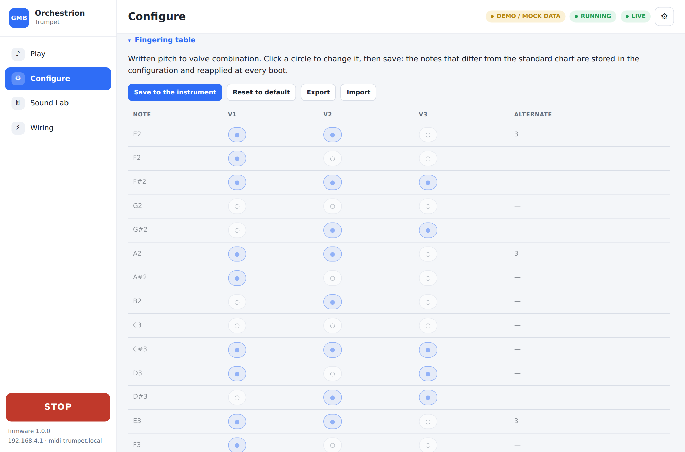
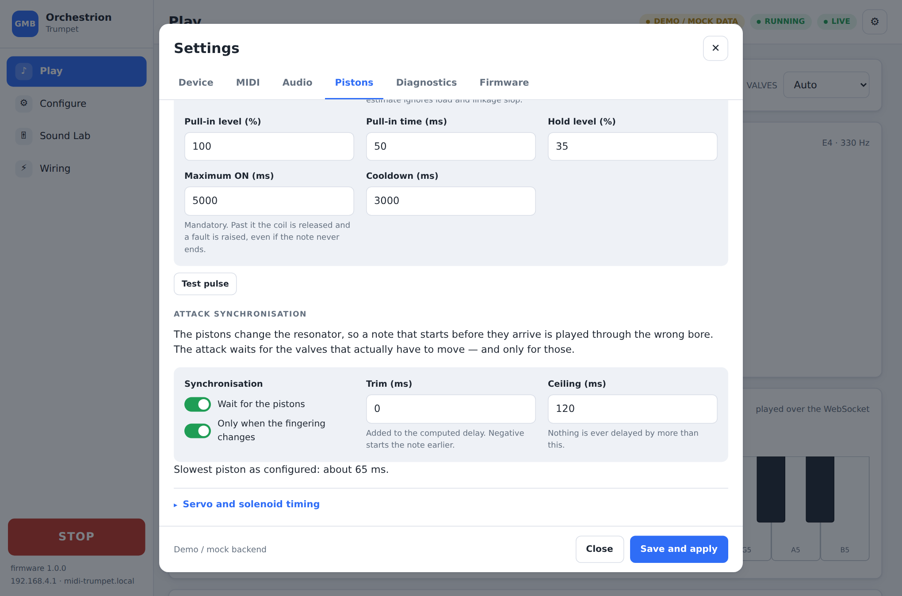

# Valves

## Overview

One to four valves, **each independently** a servo or a solenoid. A mixed
instrument — two servos and one solenoid, say — is an ordinary configuration,
not a special case: the controller keeps a driver table indexed by valve
number and dispatches to whichever driver owns each valve.

```
   MIDI note
      ↓
  NoteStack           which note wins (LAST / HIGH / LOW)
      ↓
 FingeringEngine      written pitch -> valve bitmask
      ↓
 ValveController      mode, masks, test pulses, panic
      ↓
  IValveActuator      ServoValve | Pca9685Valve | SolenoidValve
      ↓
   hardware
```

Bit 0 = valve 1, bit 1 = valve 2, bit 2 = valve 3, bit 3 = valve 4.

## Modes

| Mode | Behaviour |
|---|---|
| `AUTO` | MIDI note → fingering → valves. The default. |
| `MANUAL` | Only the web UI commands the valves. |
| `MIDI_CC` | Each valve follows its own control change (≥64 = pressed). |
| `DISABLED` | The valves are parked and ignore everything. |

## Fingering engine

The table is indexed by **written** pitch and covers the whole practical
range, F♯3 to C6:

| Note | V1 V2 V3 | | Note | V1 V2 V3 |
|---|---|---|---|---|
| F♯3 | ● ● ● | | C5 | ○ ○ ○ |
| G3 | ○ ○ ○ | | C♯5 | ● ● ○ |
| G♯3 | ○ ● ● | | D5 | ● ○ ○ |
| A3 | ● ● ○ | | E♭5 | ○ ● ○ |
| B♭3 | ● ○ ○ | | E5 | ○ ○ ○ |
| B3 | ○ ● ○ | | F5 | ● ○ ○ |
| C4 | ○ ○ ○ | | F♯5 | ○ ● ○ |
| C♯4 | ● ● ● | | G5 | ○ ○ ○ |
| D4 | ● ○ ● | | G♯5 | ○ ● ● |
| E♭4 | ○ ● ● | | A5 | ● ● ○ |
| E4 | ● ● ○ | | B♭5 | ● ○ ○ |
| F4 | ● ○ ○ | | B5 | ○ ● ○ |
| F♯4 | ○ ● ○ | | C6 | ○ ○ ○ |
| G4 | ○ ○ ○ | | | |
| G♯4 | ○ ● ● | | | |
| A4 | ● ● ○ | | | |
| B♭4 | ● ○ ○ | | | |
| B4 | ○ ● ○ | | | |

Outside that range the pattern still repeats by octave, so pedal tones and the
extreme high register get a usable fingering instead of a hole.

### Alternates

Valve 3 lengthens the tube by three semitones, exactly like valves 1+2
together, so those two grips are genuinely interchangeable:

```
1-2  ↔  3
```

No other combination has an equal-length twin, so no other note gets an
alternate by default. That is a deliberate choice: inventing alternates that
are not acoustically equivalent would produce fingerings that a player would
call wrong. Every note can still be given one by hand from the web UI.

### Editing

**Configure → Fingering table** shows the whole chart with a circle per valve.
Click to toggle, then **Save to the instrument**. Export and import are JSON,
and **Reset to default** restores the chart above.



Saving writes the edits into the configuration file and the chart is rebuilt
from the standard table plus those edits at every boot. Only the notes that
*differ* are stored — a file repeating all 128 notes would fossilise the
standard chart, typos included — and there is room for
`kMaxFingeringOverrides` (48) of them. The response says how many were stored
and whether any had to be dropped; the UI shows that rather than claiming a
save that did not fit.

### Transposition

The engine converts the incoming MIDI note to **written** pitch to look up a
fingering, and to **sounding** pitch for the synthesis. See
[MIDI.md § Instrument transposition](MIDI.md#instrument-transposition).

Example, B♭ trumpet interpreting concert pitch: concert B♭3 (MIDI 58) is
written C4 → open fingering, and the sound engine plays 58.

## Servos

### Drivers

| Driver | Where | Notes |
|---|---|---|
| `ESP32_PWM` | one LEDC channel per valve, 50 Hz, 16 bit | simplest |
| `PCA9685` | I²C expander, 16 channels | keeps the servo supply and its noise away from the ESP32, frees the LEDC channels, and the optional `OE` pin kills every output at once |

### Per-valve settings

| Setting | Default | Meaning |
|---|---|---|
| `releasedAngle` | 40° | valve up |
| `pressedAngle` | 88° | valve down |
| `speed` | 900 °/s | maximum angular speed |
| `acceleration` | 6000 °/s² | ramp in and out |
| `invert` | off | mirror the travel |
| `detachAfterMove` | on | stop the PWM once the movement is finished |
| `detachDelayMs` | 220 ms | how long to wait before detaching |
| `minPulseUs` / `maxPulseUs` | 500 / 2400 µs | the servo's pulse range |

### Motion planning

Sending a raw target angle makes a hobby servo slam into its end stop: loud,
and eventually fatal to the linkage. `ServoMotion` ramps the commanded angle
with a trapezoidal profile — accelerate, cruise at the speed limit, decelerate
so it stops exactly on target — and clamps the result to the calibrated travel
whatever the maths says.

When the movement is over and the detach delay has elapsed, the PWM is
detached (or set to a zero-length pulse on the PCA9685). The servo then stops
buzzing, stops drawing holding current and stops heating. It re-attaches
instantly on the next command.

### Calibration

The Calibration page moves the servo **immediately** as you drag a slider, so
you can set the linkage by hand with the instrument in front of you:

```
Valve 1

Released
[-] 40° [+]

Pressed
[-] 88° [+]

Speed
[ ────●──────── ]

[ Test Released ]   [ Test Pressed ]
```

## Solenoids

### Hardware

```
ESP32 GPIO ──[gate resistor]──► logic-level MOSFET ──► solenoid
                                                        ↑
                                          flyback diode, fuse,
                                          bulk decoupling
```

Never power a solenoid from the ESP32 regulator. The full circuit is in
[HARDWARE.md § Solenoids](HARDWARE.md#6-solenoids).

### Per-valve settings

| Setting | Default | Meaning |
|---|---|---|
| `gpio` | — | MOSFET gate |
| `activeHigh` | true | polarity of the gate drive |
| `pullInPwm` | 100 % | duty during the initial burst |
| `pullInMs` | 50 ms | how long the burst lasts |
| `holdPwm` | 35 % | duty once the armature has moved |
| `maxOnMs` | 5000 ms | **maximum continuous ON time** |
| `cooldownMs` | 3000 ms | forced rest after a fault |
| `maxDutyPercent` | 60 % | long-term duty ceiling |

A typical profile:

```
Pull-in      100 %   for 50 ms
Hold          35 %
Maximum on  5000 ms
```

The PWM runs at 20 kHz so it stays out of the audio band.

### Thermal protection

This is the part that must work when nothing else does.

* **Maximum continuous ON time.** Past it the coil is released, a fault is
  raised, the warning appears in the web UI and a cooldown starts. This fires
  even if the MIDI note never ends — a stuck note, a crashed sequencer or an
  unplugged cable cannot cook a coil.
* **Thermal ceiling.** A rolling window (2–20 s, derived from `maxOnMs`)
  integrates the *heating*, not the wall-clock ON time. A coil is an inductor,
  so the PWM current is smoothed and the dissipation goes as I²R: the load is
  accumulated as `duty² · dt` and reported back as the equivalent continuous
  duty. Holding at 35 % reads as 35 %, which is the whole reason the hold level
  exists. Past the ceiling the coil is released and the same cooldown applies.
  The ceiling is only enforced once the window holds at least two seconds of
  history: a coil that has just been energised is legitimately at 100 % duty,
  and firing on the first note would make the instrument unplayable.
* **Cooldown.** While it runs the coil stays off even though the note is still
  held. When it expires, if the note is *still* held, one fresh pull-in is
  allowed.
* **A configuration with no maximum ON time is refused** by the validator, and
  a stored file that somehow contains one is repaired at load. It cannot be
  switched off from the web UI.

All of this is pure logic in `SolenoidSafety`, with no hardware call, and is
covered by the host test suite — including the stuck-note case.

Three quantities are tracked separately, because conflating them is how this
guard gets it wrong:

```
continuous ON time    how long the plunger has been down, at any PWM level
applied duty          100 % during pull-in, holdPwm afterwards
thermal load          integral of duty² · dt over the window
```

> Four bugs have been found here and fixed. Two by the host tests: the class
> used `0` as an "unset" timestamp sentinel, which silently disabled the duty
> accounting when a coil was energised at millisecond 0 (right after boot, and
> again every 49.7 days when the counter wraps); and the duty window was
> enforced from the first millisecond, which tripped the guard on the very
> first note.
>
> Two more by review: the ceiling counted a coil at 35 % hold PWM as 100 %
> duty, so any note longer than about two seconds failed with `OVER_DUTY` even
> though the hold level exists precisely to allow it; and the continuous-ON
> timestamp was reset every time the observation window slid, so a solenoid
> configured at the validator's own upper bound of `maxOnMs = 20000` never
> reached its limit at all. Both now have regression tests
> (`test_solenoid_hold_level_is_not_counted_as_full_duty`,
> `test_solenoid_max_on_time_survives_the_window_sliding`).

## Attack synchronisation

A servo swinging 40° → 88° at 900 °/s is already ~53 ms behind the Note-On, and
a solenoid does not have its plunger home until its pull-in burst is over. The
sound engine and the valve engine receive the same Note-On at the same instant,
so starting the attack immediately means the first tens of milliseconds of
every note are played through the **previous fingering** — through a bore that
is physically the wrong length. On a normal loudspeaker that would not matter;
here the pistons *are* the resonator.

The engine therefore holds the attack for as long as the actuators need:

```
settle time per valve   servo    |pressed − released| / speed  + 12 ms margin
                        solenoid pullInMs                      + 12 ms margin
                        measured a bench figure always wins

delay for a note        the slowest valve that actually has to move
                        (they move together, so the delays do not add up)
                        + trim, capped at the ceiling
```

Only the valves whose state differs are considered, so slurring to a note on
the same combination costs nothing. The whole calculation is in
`src/valves/ValveTiming.cpp` — no hardware, no timers — and the engine applies
it at block boundaries (2.7 ms at 48 kHz / 128 frames).

| Setting | Default | Meaning |
|---|---|---|
| `enabled` | on | wait for the pistons at all |
| `onlyWhenFingeringChanges` | on | a repeated combination is not delayed |
| `trimMs` | 0 | bench correction, may be negative |
| `maxDelayMs` | 120 | hard ceiling, whatever the arithmetic says |

Settings → Pistons shows the estimate for the slowest piston as configured, and
the diagnostics page reports the delay the last note actually waited, so the
mechanism can be seen working rather than taken on trust.

The 12 ms margin covers linkage slop and stiction and is a guess; that is what
`measuredSettleMs` and `trimMs` are for. **Time a piston at the bench and enter
the figure** — the estimate ignores load entirely.



## Sustain

The two engines share a note stack and a fingering table, and they must never
disagree about the note being played. That includes CC 64: when the pedal holds
a note whose key has come up, the sound engine keeps it speaking, so the valve
engine holds the same fingering down until the pedal is released.

```
pedal down, key down     the fingering of the note, as usual
pedal down, key up       that fingering is held
pedal down, new note     the new note wins, and becomes what the pedal holds
pedal up                 released, unless a key is still down
All Notes Off / panic    released, and the pedal is no longer considered down
```

A valve mapped to CC 64 in `MIDI_CC` mode still follows it as a plain
controller — the pedal only holds a fingering in `AUTO`, where there is a note
to hold.

## PANIC

Reachable from the web UI, over MIDI and through `POST /api/panic`. It
immediately:

```
stop audio
release all valves
disable solenoids
stop servos
clear active MIDI notes
```

Order matters: silence first, then park the mechanics. After a panic the
valves ignore MIDI until the user releases them, and the run mode is `PANIC`
until then.

A software panic is a complement to, never a replacement for, the physical
emergency stop that cuts the actuator supply without going through the
firmware.

## Boot and reset behaviour

* Solenoid gates are driven to their inactive level **before** the PWM unit is
  configured, so a reset can never leave a coil energised.
* Servos are commanded to their released angle as the first thing `begin()`
  does.
* The PCA9685 `OE` pin is held high (outputs disabled) before the I²C bus is
  even configured, so nothing twitches at power-up.
* In SAFE MODE no valve driver is started at all.

## Testing without hardware

`MockValveActuator` implements `IValveActuator` and records every call, so the
whole controller — fingering, masks, modes, All Notes Off, panic, mixed
configurations — is exercised on a PC:

```bash
pio test -e native -f test_valves
```
